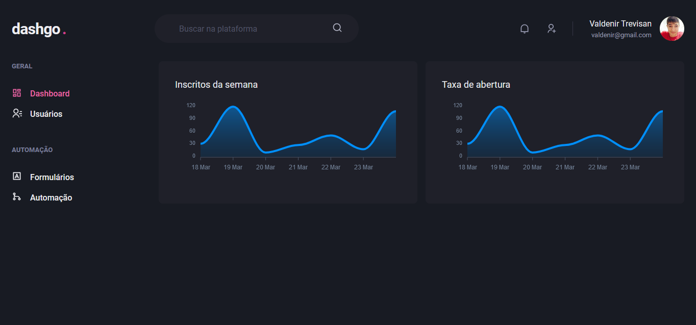

<h1 align="center" >Dashgo 🚀</h1>

  
  
  

 
  

Dashboard genérico e responsivo em construção 🚧

<h2>💻 Tecnologias:</h2>

- <a href="https://nextjs.org" > Next.js </a>
- <a href="https://www.typescriptlang.org/"> TypeScript </a>
- <a href="https://chakra-ui.com"> Chakra UI </a>
- <a href="https://apexcharts.com"> Apexcharts.js </a>
- <a href="https://react-hook-form.com"> React Hook Form </a>
- <a href="https://github.com/jquense/yup"> Yup </a>
- <a href="https://react-query.tanstack.com"> React Query </a>
- <a href="https://miragejs.com"> Mirage JS </a>
- <a href="https://github.com/marak/Faker.js/"> Faker </a>

<h2>📝 Licença:</h2>

Este projeto está licenciado sob a licença MIT - consulte a página <a href="https://opensource.org/licenses/MIT" style=" font-size: 16px; " >LICENSE</a> para obter detalhes.

 
 
 

Desenvolvido com ❤️ por <a href="https://github.com/valdenirtrevisan" style=" font-size: 16px;" >Valdenir Trevisan Junior</a>
